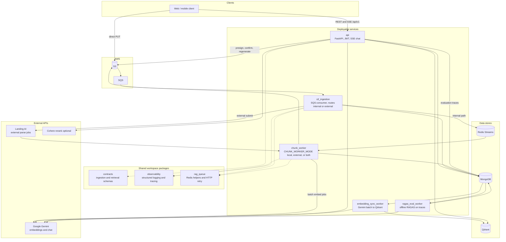
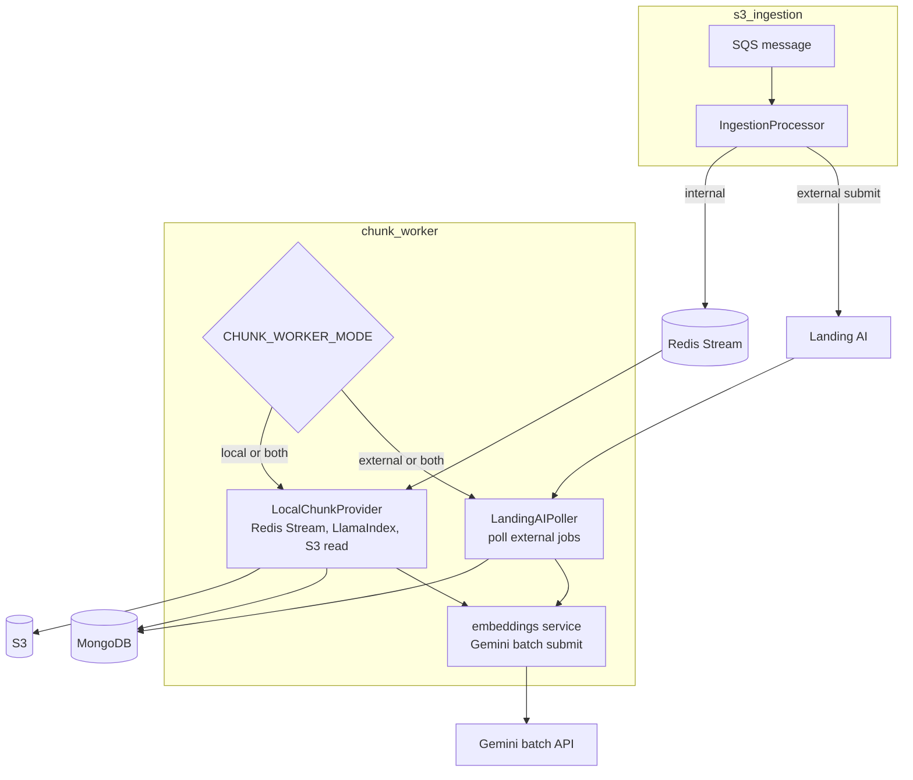
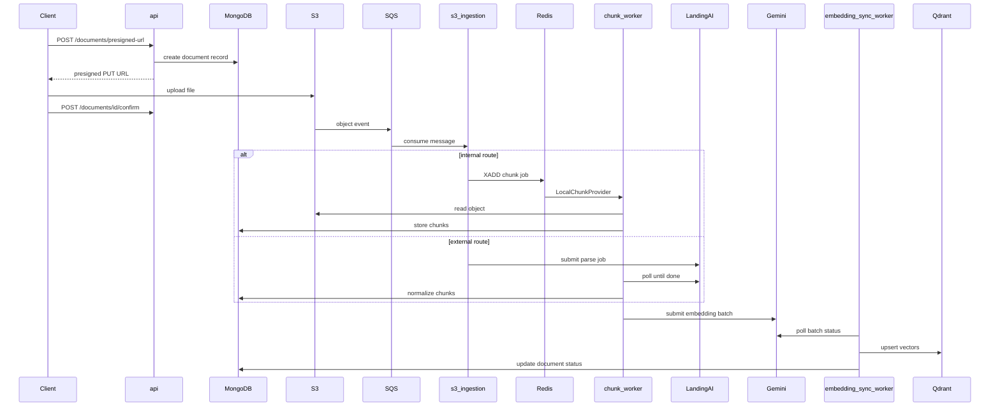
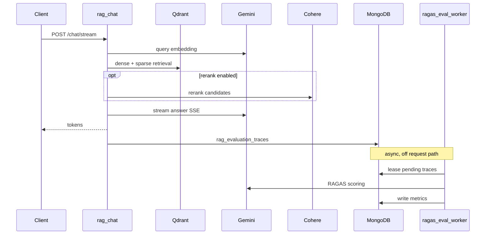
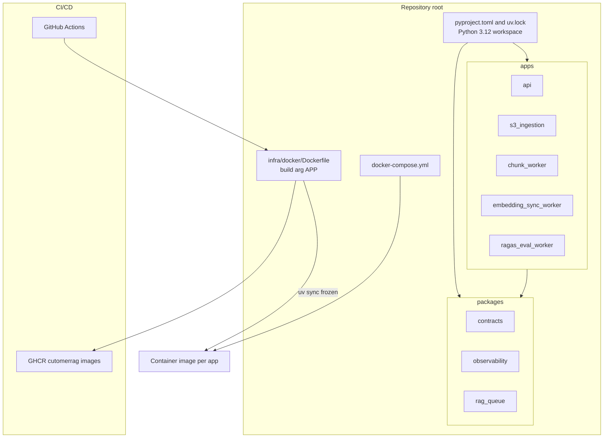
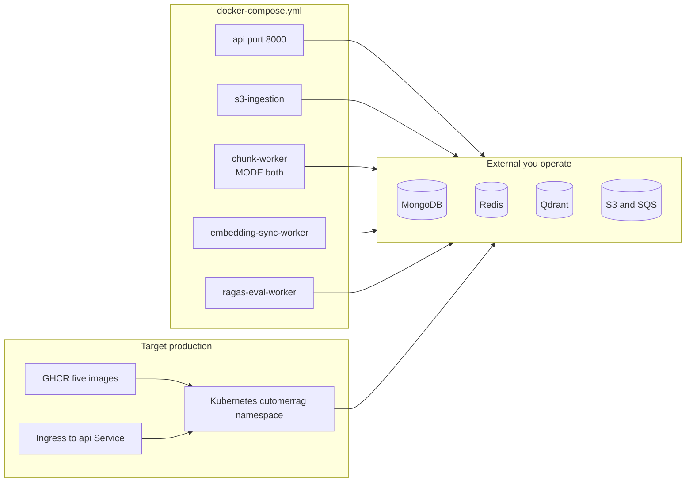
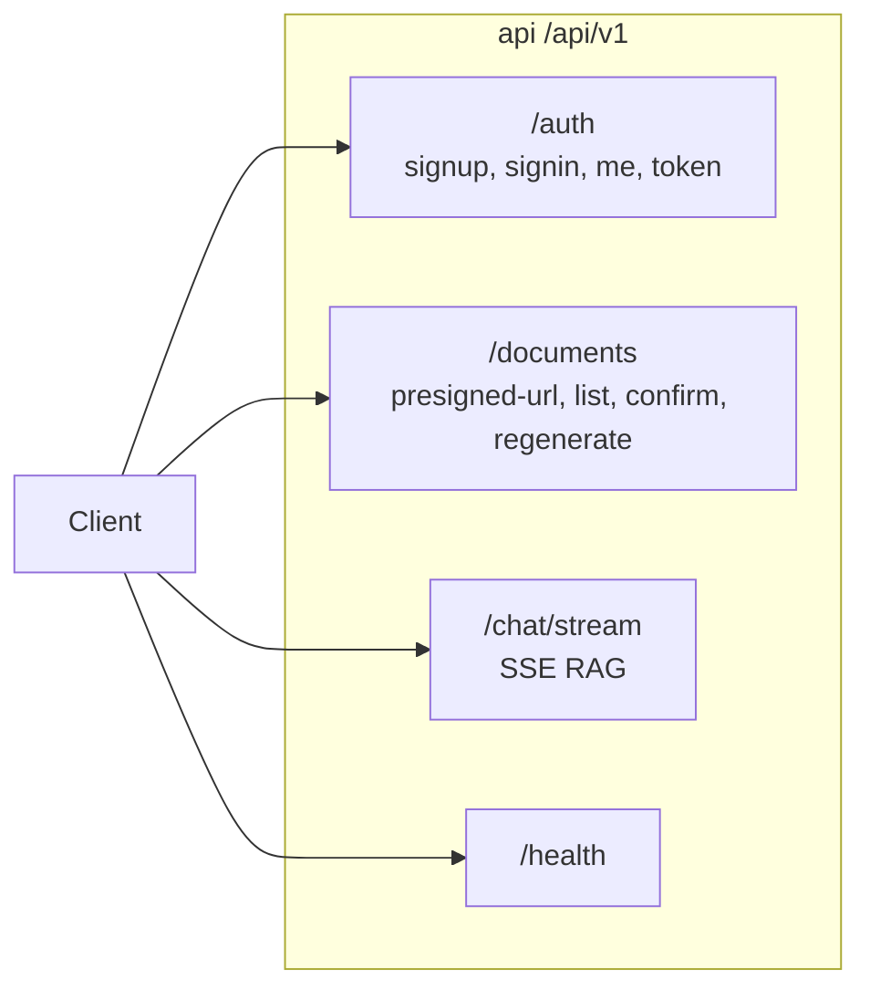

# CustomerRAG

Production-style Retrieval-Augmented Generation (RAG) backend for secure document upload, asynchronous parsing, chunk generation, embedding orchestration, and Qdrant vector sync.

## Why This Project Exists

CustomerRAG is built for teams that want more than a demo chatbot. It provides a practical ingestion and indexing pipeline for documents, with:

- FastAPI-based auth and upload APIs
- Direct-to-S3 uploads using pre-signed URLs
- Async ingestion with SQS and Redis Streams
- Two document parsing paths: internal chunking or external parsing
- Gemini batch embedding submission
- Qdrant vector synchronization
- MongoDB-backed status tracking and idempotency

This repo is useful if you are searching for:

- `production rag backend`
- `fastapi rag api`
- `s3 presigned upload rag pipeline`
- `mongodb redis qdrant rag architecture`
- `async document ingestion for llm search`
- `gemini embeddings qdrant example`

## What It Does

The system accepts user uploads, tracks each document in MongoDB, routes the file through either an internal chunker or an external parser, submits chunk text for embeddings, then syncs the resulting vectors into Qdrant for retrieval use cases.

High-level flow:

1. User signs up or signs in.
2. API issues an S3 pre-signed upload URL and creates a `documents` record.
3. Client uploads file to S3 and confirms upload.
4. S3 event reaches the ingestion worker through SQS.
5. Ingestion worker decides:
   - internal chunking via Redis Streams
   - external parsing via Landing AI
6. Chunks are stored in MongoDB.
7. Gemini embedding batch jobs are submitted.
8. Embedding sync worker polls Gemini and upserts vectors into Qdrant.
9. Chat requests can emit Mongo-backed RAG evaluation traces for offline RAGAS scoring.

## System Architecture

### Runtime overview



### Unified chunk worker

`local_chunk_worker` and `external_chunk_worker` are merged into a single `chunk_worker` process controlled by `CHUNK_WORKER_MODE`.



### Document lifecycle (ingestion → vectors)



### RAG chat (query time)



### Monorepo and build layout



### Local dev vs production deploy



### API surface



## File Structure

```

├── apps
│   ├── api
│   ├── chunk_worker
│   ├── embedding_sync_worker
│   ├── ragas_eval_worker
│   └── s3_ingestion
├── packages
│   ├── contracts
│   ├── observability
│   └── queue
├── infra
│   └── docker
├── ARCHITECTURE.md
├── docs
├── k6
├── docker-compose.yml
├── pyproject.toml
└── uv.lock
```

## Services

### `apps/api`

FastAPI application for:

- authentication
- rate limiting
- document upload session creation
- upload confirmation
- document listing

### `apps/s3_ingestion`

SQS-driven ingestion router that:

- listens for S3 object-created events
- claims document ownership in MongoDB
- routes work to internal or external processing

### `apps/chunk_worker`

Unified daemon entry point that orchestrates internal chunking and external parsing, driven by `CHUNK_WORKER_MODE` (`local`, `external`, `both`):

- reads documents from S3 and chunks them with LlamaIndex (local mode)
- monitors Landing AI external parse jobs (external mode)
- stores chunks in MongoDB
- submits embedding jobs to Gemini

### `apps/embedding_sync_worker`

Gemini embedding poller that:

- tracks batch job completion
- downloads or reads inline embedding results
- maps embeddings back to chunks
- upserts vectors into Qdrant

### `apps/ragas_eval_worker`

Offline RAGAS evaluator that:

- claims pending chat traces from MongoDB
- evaluates `before_rerank` and `after_rerank` trace variants separately
- stores metric results back into MongoDB without slowing the live chat stream

## Core Infrastructure

- MongoDB for users, document state, and chunks
- Redis Streams for internal chunk work distribution
- AWS S3 for document storage
- AWS SQS for S3 event delivery
- Landing AI for external document parsing
- Gemini batch embeddings for vector generation
- Qdrant for vector search storage

## Document Lifecycle

Common statuses visible in the codebase include:

- `pending`
- `uploaded`
- `processing`
- `queued_for_chunking`
- `chunking`
- `landing_ai_pending`
- `completed`
- `failed`
- `chunk_failed`

Embedding-specific fields are tracked separately with values such as:

- `submitted`
- `polling`
- `completed`
- `failed`
- `skipped`

## How to Run This Project

This project uses `uv` for monorepo workspace dependency management.

1. **Install uv**: Follow the instructions at [astral.sh/uv](https://docs.astral.sh/uv/).
2. **Sync Dependencies**: Run `uv sync` at the workspace root to resolve and install all apps and shared packages.
3. **Configuration**: Set up your environment variables (MongoDB, Redis, AWS, Gemini, Qdrant) in the `.env` file.
4. **Start Infrastructure**: Use Docker Compose to spin up the required datastores and services:
   ```bash
   docker-compose up -d
   ```
5. **Local Execution**: You can run individual services locally using `uv run main.py` inside each app folder. The unified chunk worker supports `CHUNK_WORKER_MODE=local`, `external`, or `both` (default) to toggle parsing paths.

## API Highlights

Important routes include:

- `POST /auth/signup`
- `POST /auth/signin`
- `GET /auth/me`
- `POST /documents/presigned-url`
- `POST /documents/{document_id}/confirm`
- `POST /documents/{document_id}/regenerate` (re-issue presigned URL)
- `GET /documents/`
- `POST /chat/stream` (SSE RAG chat)

## Load Testing

The `k6/` directory contains API and stress test scripts for:

- signup
- signin
- current user lookup
- pre-signed URL creation
- upload confirmation

## Deployment (Docker, Kubernetes, CI/CD)

Infrastructure lives under `infra/` with a root `Makefile` and GitHub Actions workflows.

- **Container registry:** [GitHub Container Registry (GHCR)](https://docs.github.com/en/packages/working-with-a-github-packages-registry/working-with-the-container-registry) — `ghcr.io/devmittal1/cutomerrag-*`
- **Build:** `make build` / `make build-api`
- **Push:** `make release` (requires `GITHUB_TOKEN`)
- **Kubernetes:** `make k8s-apply` (Kustomize overlay at `infra/kubernetes/overlays/prod`)

See [infra/README.md](./infra/README.md) for secrets, ingress, and cluster setup.

## Architecture Doc

Narrative architecture (flows, state machines, design notes) lives in [ARCHITECTURE.md](./ARCHITECTURE.md). Diagrams above are the visual companion for the current five-service layout.

## Good Fit For

- teams building secure document-ingestion backends
- engineers evaluating async RAG indexing pipelines
- developers looking for FastAPI + MongoDB + Redis + Qdrant patterns
- search and retrieval systems that need explicit document lifecycle tracking

## Current Shape Of The Repo

This repository is stronger on backend ingestion and indexing than on final chat/query UX. It is best understood as the ingestion and vectorization foundation for a larger RAG platform.
